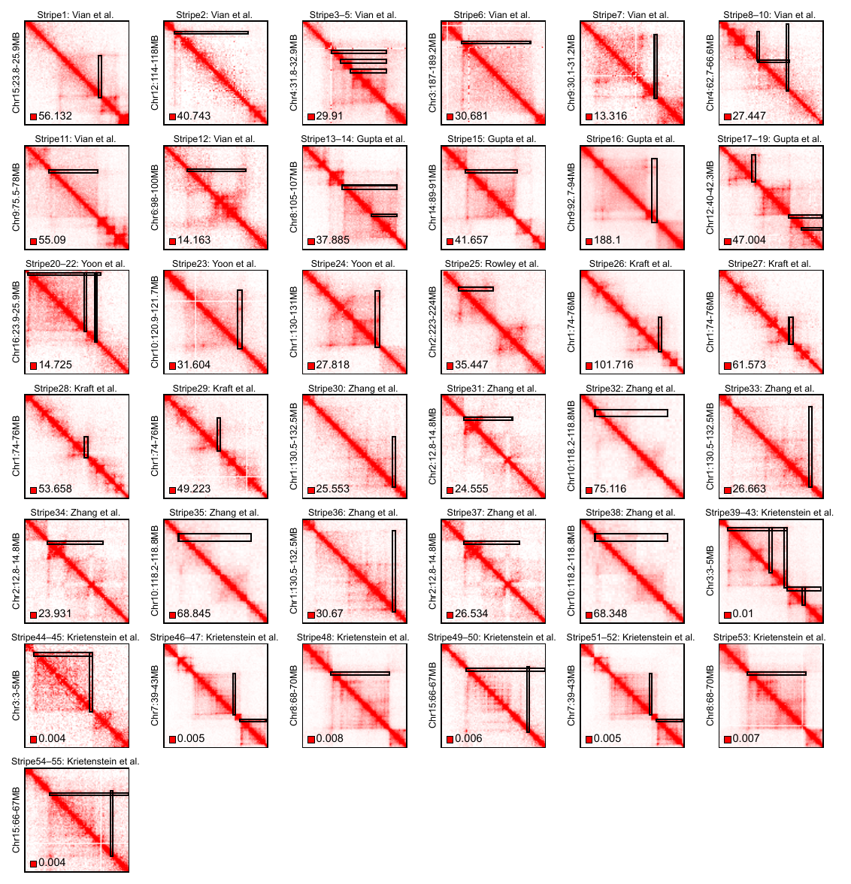

# Gold-standard Hi-C Stripes Dataset

## Dataset Description & Manifest Overview

This repository contains the **gold-standard bulk Hi-C stripes dataset**. The core metadata for each stripe is recorded in the manifest files:  

- **TSV:** `manifest/stripes.manifest.tsv`  
- **CSV:** `manifest/stripes.manifest.csv`  

Each row corresponds to one manually curated stripe (55 stripes in total) and includes all relevant metadata, such as genomic location, sample source, experimental conditions, patch matrix path, etc.  

The manifest is validated against the **JSON Schema** `manifest.schema.json` to ensure completeness and consistency.

---

## Field Descriptions

| Column                 | Type    | Description                                                                                                                       | Example                                           |
| ---------------------- | ------- | --------------------------------------------------------------------------------------------------------------------------------- | ------------------------------------------------- |
| **Stripe Id**          | string  | Unique identifier for each stripe. Must match pattern `stripe_XXXX` (4 or more digits).                                           | `stripe_0001`                                     |
| **Reference**          | string  | Literature or author of the data source.                                                                                          | `Vian et al.`                                     |
| **Species**            | string  | Organism for the sample. Usually `human` or `mouse`.                                                                              | `mouse`                                           |
| **Genome Build**       | string  | Genome version for coordinates, e.g., hg19, hg38, mm9, mm10.                                                                      | `mm10`                                            |
| **Biosample**          | string  | Biological sample type used in the experiment, e.g., cell line or tissue.                                                         | `E11.5 distal limb`                               |
| **Assay**              | string  | Experimental assay used, typically Hi-C or Micro-C.                                                                               | `Hi-C`                                            |
| **Accession**          | string  | Accession number in public database (GEO, 4DN, etc.).                                                                             | `GSE63525`                                        |
| **Resolution Bp**      | integer | Resolution used for data extraction (in base pairs). For example, `10000` = 10 kb bins.                                           | `10000`                                           |
| **Normalization**      | string  | Normalization method applied: ICE, KR, OE, or raw, etc.                                                                                | `KR`                                              |
| **Chrom**              | string  | Chromosome where the stripe is located.                                                                                           | `chr15`                                           |
| **Stripe Region**      | string  | Genomic region of the stripe, including both width and length. <br>Format: `Chr<chrom>:<start>-<end> Chr<chrom>:<start>-<end>` | `Chr15:25310001-25370000 Chr15:24490001-25370000` |
| **Orientation**        | string  | Stripe orientation, either `left` or `right`.                                                                                     | `left`                                            |
| **Patch Matrix Size**  | integer | Dimension of the patch interaction matrix (number of bins). Must be ≥1.                                                           | `215`                                             |
| **Patch Genomic Span** | string  | Genomic length covered by the patch matrix (in MB). <br>Format: `<number>MB`                                   | `2.14MB`                                          |
| **Patch Region**       | string  | Specific genomic coordinates of the patch matrix. <br>Format: `Chr<chrom>:<start>-<end>` | `Chr15:23790000-25930000`                         |
| **Patch Path**         | string  | File path to the patch interaction matrix file.                                                                                   | `patches/gold_st_mat1_matrix.txt`                   |

---

## File Structure & Data Overview

- The **manifest files** record all metadata for the 55 manually curated stripes.  
- The **patches/** folder contains the Hi-C submatrices for each stripe and visualizations.  
- The **scripts/** folder includes validation scripts to check manifest integrity and schema compliance.

---

## Visualization

To provide a quick overview of all 55 curated Hi-C stripes, we generated a **summary heatmap** that visualizes the interaction patterns of each stripe patch.  



**Notes:**
- The heatmap PDF is stored in `patches/all_stripes_heatmaps/heatmap_allstripes.pdf`.  
- Each matrix represents a single patch, which contains the stripe.
- This visualization can help users quickly identify global patterns.  
- The PDF can be opened with any standard PDF viewer.

---

## Schema Validation / Notes / Considerations

- Manifest files are validated using **manifest.schema.json** (JSON Schema Draft 7).  
- All 17 fields are **required**.  
- Additional fields are **not allowed** (`additionalProperties: false`).  
- Empty or missing values may cause validation errors.  
- Fields such as **Resolution Bp** and **Patch Matrix Size** **must be integers**.  
- Ensure that all file paths in `Patch Path` exist in the `patches/` folder.

---

## Example Usage

```bash
# Validate manifest
python scripts/validate_manifest.py manifest/stripes.manifest.tsv --schema manifest/manifest.schema.json
```

---

## Version & Updates

| Version | Date       | Changes / Notes                                      |
| ------- | ---------- | --------------------------------------------------- |
| 1.0     | 2026-01-12 | Initial release of gold-standard Hi-C stripes dataset, including 55 manually curated stripes with manifest, patch matrices, heatmaps, and validation scripts. |

---

## Contact

For questions or issues regarding this dataset, please contact:  

**Name:** Liling  
**Email:** Liling@example.com  
**Affiliation:**  Sun Yat-sen University

